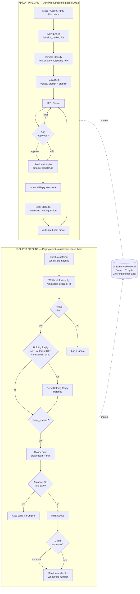
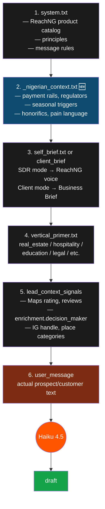
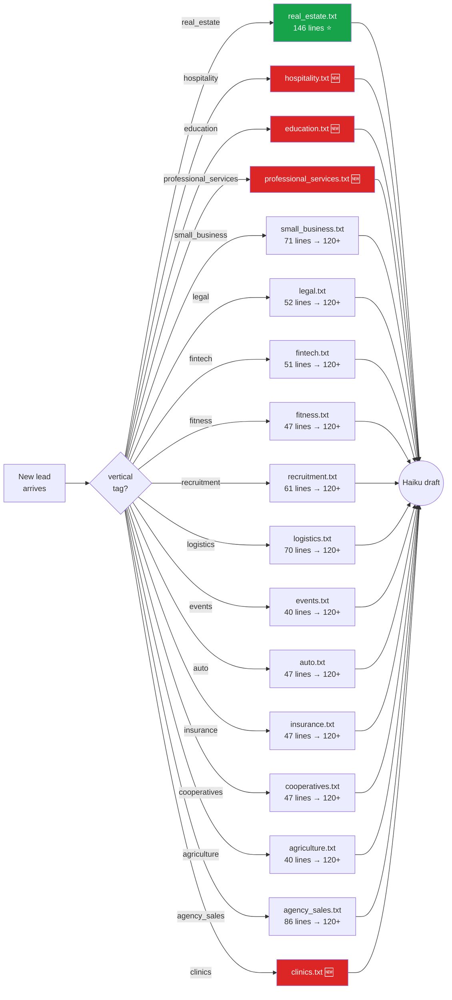
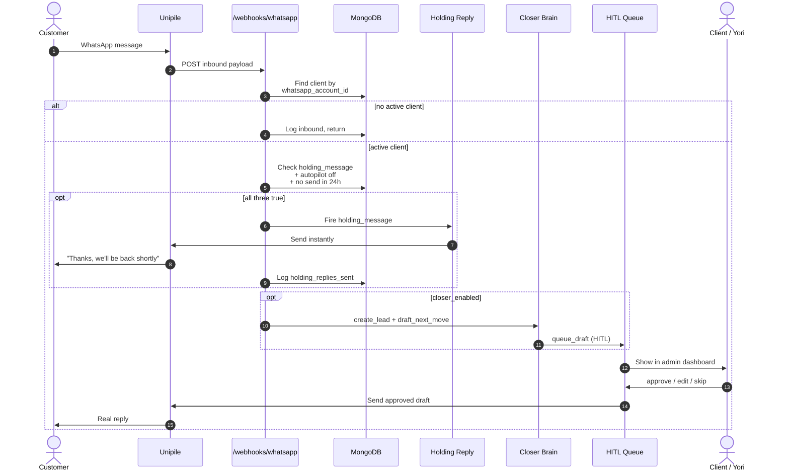
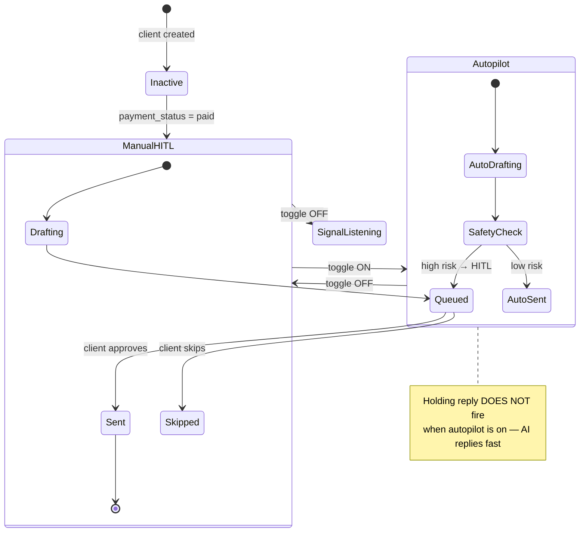

# ReachNG — Operations Flow

Two parallel pipelines, one shared brain. This document is the canonical mental model.

- **SDR pipeline** = ReachNG's own outreach. Yori → Lagos SMEs.
- **Client pipeline** = a paying client's outreach. Client's customer → ReachNG draft → Client.

Both share the same Haiku model and the same HITL approval gate.

---

## 1. The two pipelines side-by-side

---

## 2. The drafting prompt stack (how a single message gets composed)

This is the layered system prompt that wraps every Haiku call. Each layer adds context the layer above doesn't have.

🆕 = the layer being added next session (Nigerian Market Fluency).

---

## 3. Vertical routing (which prompt file fires)

Every lead has a `vertical` tag. The drafter loads `agent/prompts/{vertical}.txt`. If unknown, falls back to `general` (a future generic prompt).

⭐ = current gold standard. 🆕 = missing, to build. The rest are getting brought up to gold standard.

---

## 4. Inbound message routing — single picture

When a WhatsApp comes in, this is exactly what happens:

---

## 5. Operational state — what each toggle controls

---

## 6. Where each piece of code lives

| Concern | File |
|---------|------|
| Discovery (Maps) | `tools/discovery.py` |
| Discovery (Apify) | `tools/apify_discovery.py` + `tools/apify_enrich.py` |
| SDR drafting brain | `agent/brain.py::generate_outreach_message()` |
| Vertical prompts | `agent/prompts/{vertical}.txt` |
| HITL queue | `tools/hitl.py::queue_draft()` |
| Inbound webhook | `api/webhooks.py` |
| Holding reply | `api/webhooks.py::_maybe_send_holding_reply()` |
| Closer brain | `services/closer/brain.py::draft_next_move()` |
| Universal sender | `tools/outreach.py::send_whatsapp_for_client()` |
| Demo portals | `services/demo_datasets.py` + `templates/portal_demo.html` |
| Admin dashboard | `templates/dashboard.html` |
| Client portal | `templates/portal.html` |
| Business Brief (next session) | `services/brief/` (to build) |

---

## 7. Reading order for new contributors

If you're new to the codebase, read these in order:

1. `CLAUDE.md` — project rules + stack
2. `PLAN.md` — what's being built right now
3. `BACKLOG.md` — what's queued
4. **This file** — how it all fits together
5. `agent/prompts/system.txt` + `self_brief.txt` — the voice
6. `agent/prompts/real_estate.txt` — the gold-standard vertical prompt example
7. `api/webhooks.py` — single source of truth for inbound routing
